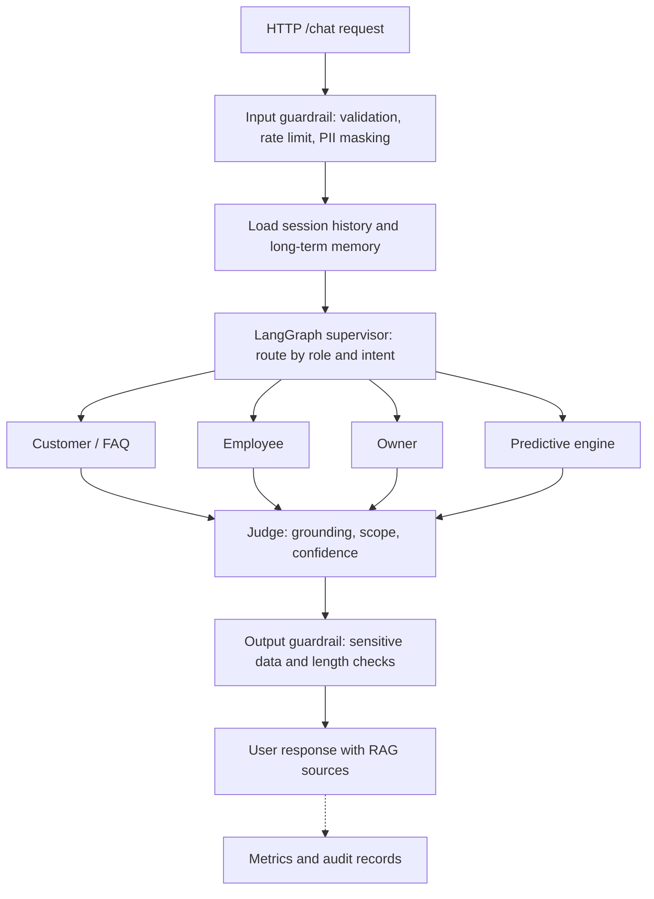

# Mottainai IA Layer — Architecture

This document describes implementation contracts in English. System prompts, model-facing context, and user-facing responses remain in Portuguese because the product serves Portuguese-speaking users. Existing route names, role values, and database keys are external contracts.

## Request flow

The Judge fails closed. A rejected or unavailable evaluation leads to a safe response rather than releasing an unvalidated answer. Session access is scoped to `empresa_id + usuario_id`. Customer and FAQ agents do not receive internal operational data.

## Agent responsibilities

| Agent | Main responsibility | Data and tools |
| --- | --- | --- |
| Supervisor | Route the request to the permitted agent and record the decision. | Role, intent catalog, `routing_logs` |
| Customer | Answer questions about promotions, partner stores, loyalty, and sustainability. | Tenant-scoped RAG in MongoDB |
| FAQ | Answer general Mottainai help questions. | Tenant-scoped RAG in MongoDB |
| Employee | Answer operational stock questions and handle confirmed write requests. | PostgreSQL, Redis, RAG |
| Owner | Provide KPIs, loss analysis, and store comparisons. | PostgreSQL, RAG |
| Predictive engine | Forecast demand and prepare loss-risk alerts and suggestions. | PostgreSQL, Open-Meteo |
| Vision | Analyze shelf images with authenticated tenant and session context. | Gemini Vision, PostgreSQL |
| Judge | Check grounding and authorization scope before output. | Agent response, sources, `prompt_evaluations` |
| Governance | Produce tenant-scoped audit and compliance information. | Execution records and metrics |

Business operations require explicit user confirmation. Predictive suggestions and alerts do not authorize an automatic inventory change.

## Infrastructure

| Component | Purpose |
| --- | --- |
| FastAPI in `interfaces/api/main.py` | HTTP routes, authentication, health checks, and request lifecycle |
| LangChain and LangGraph | Model adapters and agent orchestration |
| PostgreSQL | Operational source of truth and tenant-scoped queries |
| MongoDB | Sessions, messages, long-term memory, RAG documents, and audit records |
| Redis | Rate limits, idempotency, notifications, and short-lived state |
| Local embeddings | `sentence-transformers/all-MiniLM-L6-v2` for RAG retrieval |
| Open-Meteo | External weather context for forecasting |

The text model is configurable through `config/settings.py` (Groq or Ollama). `JWT_SECRET` must be a unique configured value; startup rejects missing, weak, and documented placeholder values.

## Implementation map

| Concern | Implementation |
| --- | --- |
| API and health endpoints | `interfaces/api/main.py` |
| Agent graph and routing | `app/agents/supervisor.py` |
| Session and long-term memory | `app/memory/` |
| Domain tools and data access | `app/tools/` |
| RAG retrieval and external sources | `app/rag/` |
| Judge and output validation | `app/agents/juiz.py`, `app/guardrails/saida.py` |
| Metrics and technical audit | `app/observability/` |
| Settings and environment contracts | `config/settings.py`, `.env.example` |
| Contract tests | `tests/` |
